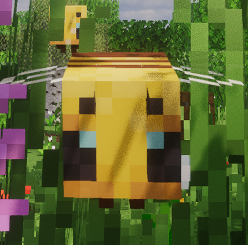

# Beekeeper



A NeoForge mod for Minecraft 1.21.1 that adds a full beekeeper's toolkit - a
protective outfit and a smoker - so you can work with hives and bees without
getting swarmed.

## Items

### Beekeeper Outfit
Only the hat provides actual armor; the jacket, pants and boots are cosmetic
pieces of the same outfit.

- **Beekeeper Hat** - helmet piece.
  This is the key item: **you must wear the hat to use the smoker on a hive.**
  While worn, the hat also hides the outer (second) layer of your player skin so
  your hat detail no longer pokes through the helmet.
- **Beekeeper Jacket** - chestplate (cosmetic, no defense).
- **Beekeeper Pants** - leggings (cosmetic, no defense).
- **Beekeeper Boots** - boots (cosmetic, no defense).

### Smoker
A durable tool (65 durability, stacks to 1) for calming bees.

- **Right-click a beehive or bee nest** (while wearing the beekeeper hat) to
  smoke the hive. For a short time the hive stays sedated - bees do not become
  aggressive when you harvest honey or break the hive. This works just like a
  campfire placed under a nest, but portable and targeted.
- **Right-click in the air** to puff the smoker, instantly calming (clearing
  the target of) any angry bees within a radius around you.
- Each use costs durability and puts the smoker on a short cooldown.
- Repairable with iron ingots and enchantable at the enchanting table.

## Enchantments

The smoker supports three exclusive enchantments:

- **Smoke Radius** (max III) - increases the blocks around the smoked hive /
  player in which already angry bees are calmed.
- **Lingering Smoke** (max III) - adds extra time to how long a hive stays
  sedated after being smoked.
- **Quick Stoking** (max III) - shortens the cooldown between smoker uses
  (down to a configurable floor).

The beekeeper hat supports one exclusive enchantment:

- **Bee Tracker** - while worn, every bee within 48 blocks is given a hidden
  Glowing outline so you can see them through walls. The outline refreshes
  several times per second so it never flickers.

## Configuration

All tunable values live in `config/beekeeper-common.toml` and can be edited
in-game via *Mods → Beekeeper → Config*:

| Option | Default | Description |
|---|---|---|
| `smokeDurationTicks` | `1200` (60s) | How long a hive stays calmed after being smoked. |
| `basePacifyRadius` | `8.0` | Radius (blocks) around the hive / player in which angry bees are calmed. |
| `baseCooldownTicks` | `20` (1s) | Smoker use cooldown before any Quick Stoking. |
| `radiusBonusPerLevel` | `2` | Blocks added to the pacify radius per Smoke Radius level. |
| `durationBonusPerLevel` | `400` (20s) | Ticks added to the hive smoke duration per Lingering Smoke level. |
| `cooldownReductionPerLevel` | `4` | Ticks removed from the cooldown per Quick Stoking level. |
| `minCooldownTicks` | `4` | Hard floor for the cooldown, regardless of Quick Stoking. |

## Integrations

- **JEI** - recipes and item list are shown in the JEI overlay when JEI is
  installed.
- **Jade** - when Jade is installed, looking at a hive shows its remaining
  smoke time and the bees' anger state.

Both are optional for end users; the mod works without them.

## Requirements

- Minecraft 1.21.1
- NeoForge 21.1.243
- **GeckoLib 4.9.2** (required - the beekeeper outfit is rendered with it)
- Java 21

## Building

```
./gradlew build
```

The compiled jar is placed in `build/libs/`.

## Credits

Built on the [NeoForge](https://neoforged.net/) modding platform with mappings
from Mojang and [Parchment](https://parchmentmc.org/). 3D models and rendering
powered by [GeckoLib](https://github.com/bernie-g/geckolib).